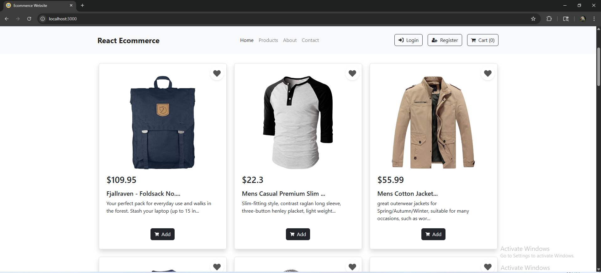

# Instructions

This is Ecommerce Site Product Page.
Implements Product Card with modern layout using bootstrap.
Using Product.jsx to define reusable component inside Products.jsx file.

# Install dependencies

npm install

# Start the server

npm start

# What to change
Update Product.jsx file exists in src/components path.

# Screenshot

